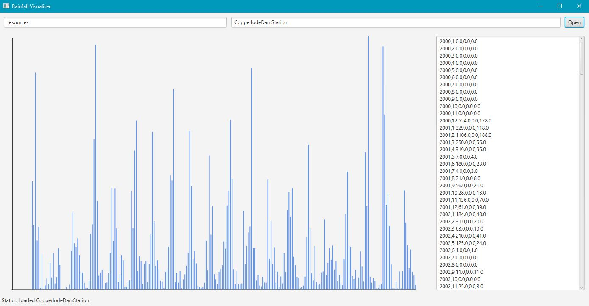

# Bureau of Meteorology Rainfall Analyser

The Australian Bureau of Meteorology (BOM) provides a range of climate information about different parts of Australia.
In particular, the Climate Data Online service provides access to rainfall data for many different Australian cities and suburbs.
For example, Copperlode Dam station has been recording rainfall data since the year 2000. 

* Reads BOM rainfall data for 10+ years from csv text files

* Calculates monthly rainfall totals along with minimum daily and maximum daily rainfall during each month, across the 10+ years’ worth of data

* Outputs calculated data to analysed text file

* Reads analysed file and outputs useful information to GUI (using JavaFX)

* Translates data into dynamic bar chart

---

